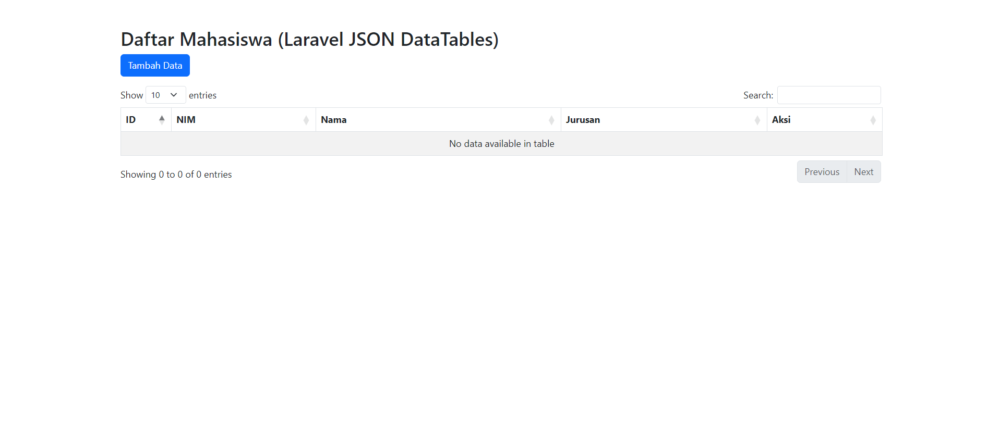
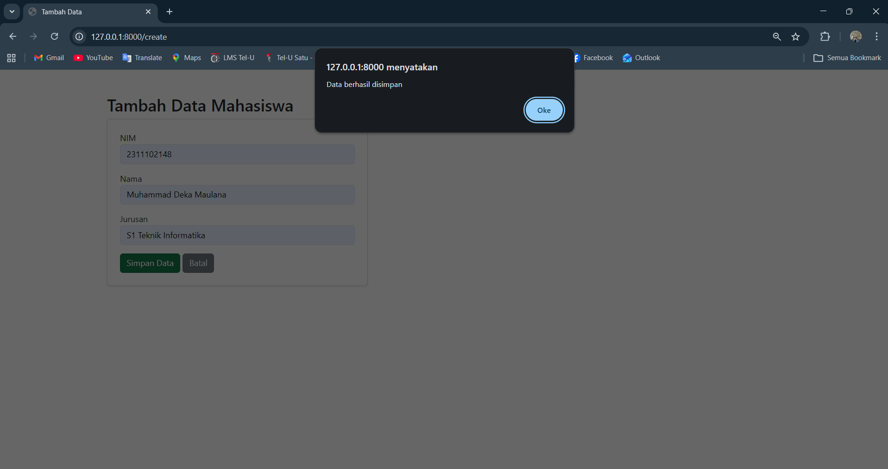
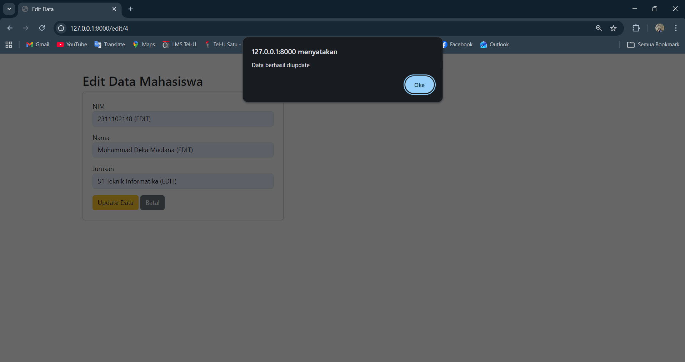
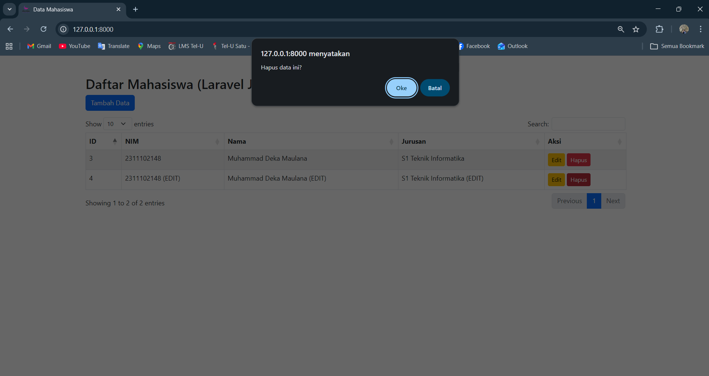
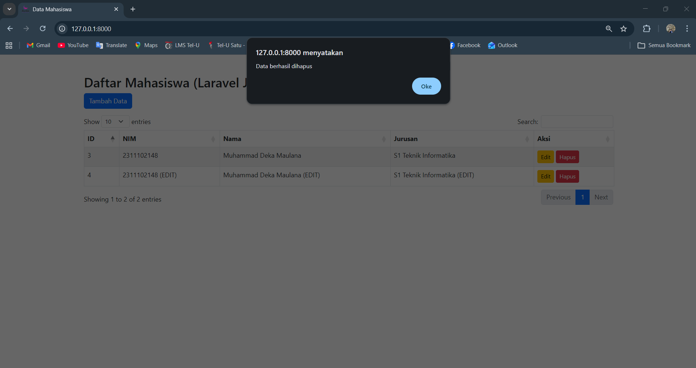

<div align="center">
   <h2>LAPORAN PRAKTIKUM<br>APLIKASI BERBASIS PLATFORM</h2>
   <br>
   <h4>TUGAS 4<br>WEB FRAMEWORK 1</h4>
   <br>
   
   <br><br>
 
**Disusun Oleh :**<br>
MUHAMMAD DEKA MAULANA<br>
2311102148<br>
PSIF-11-REG04
<br><br>
 
**Dosen Pengampu :**<br>
Cahyo Prihantoro, S.Kom., M.Eng
<br><br>
 
PROGRAM STUDI S1 TEKNIK INFORMATIKA<br>
FAKULTAS INFORMATIKA<br>
UNIVERSITAS TELKOM PURWOKERTO<br>
2026

</div>

---

## 1. Dasar Teori

**HTML, CSS, dan Bootstrap** HTML (HyperText Markup Language) menangani elemen dasar pembangunan struktur website, sementara CSS (Cascading Style Sheets) digunakan untuk memperindah tampilan web tersebut. Pada proyek ini, proses *styling* diakselerasi menggunakan **Bootstrap**, sebuah *front-end framework* yang menyediakan *class-class* bawaan untuk membangun UI (seperti form, tombol, dan tabel) secara cepat, responsif, dan konsisten di berbagai perangkat.

**JavaScript & jQuery** JavaScript adalah bahasa pemrograman yang membuat halaman web statis menjadi interaktif. Untuk mempermudah manipulasi DOM dan pengelolaan *event*, digunakan **jQuery**, sebuah *library* JavaScript yang ringkas. Salah satu implementasi krusial jQuery dalam proyek ini adalah penggunaan AJAX (`$.ajax()`) untuk melakukan pertukaran data secara asinkron (mengirim dan menerima JSON) tanpa perlu melakukan *reload* halaman.

**DataTables**
DataTables merupakan *plugin* dari jQuery yang digunakan untuk memoles tabel HTML biasa menjadi tabel tingkat lanjut (Advanced Table). *Plugin* ini secara otomatis menyediakan fitur pencarian (*search*), pengurutan (*sorting*), dan pembagian halaman (*pagination*). Pada proyek ini, DataTables dikonfigurasi untuk menerima sumber data berformat JSON dari API *backend*.

**Laravel Framework (Backend)**
Laravel adalah *framework* aplikasi web berbasis PHP dengan arsitektur MVC (Model-View-Controller). Dalam konteks tugas ini, Laravel bertindak sebagai *backend provider* (API). Controller Laravel dirancang untuk tidak mengembalikan tampilan HTML secara langsung saat data diminta, melainkan mengembalikan respon berupa data JSON (`response()->json()`) yang kemudian dikonsumsi oleh AJAX di *frontend*.

---

## 2. Kode Program & Implementasi

*Tugas COTS 1 - Arsitektur Web & Framework*

**Ketentuan Tugas:**
1. Menggunakan Framework Bootstrap.
2. Memiliki 3 Halaman (Form Tambah, Edit, Tabel CRUD).
3. Menggunakan Framework (Diimplementasikan dengan Laravel).
4. Menggunakan JQuery Plugin (DataTables).
5. Menggunakan format data JSON untuk tabel.

### A. Kode Backend (Laravel Controller - `MahasiswaController.php`)

```php
<?php

namespace App\Http\Controllers;

use App\Models\Mahasiswa;
use Illuminate\Http\Request;

class MahasiswaController extends Controller
{
    // Menampilkan Halaman
    public function index() { return view('mahasiswa.index'); }
    public function create() { return view('mahasiswa.create'); }
    public function edit($id) { return view('mahasiswa.edit', compact('id')); }

    // API Endpoint: Read Data JSON
    public function dataJson() {
        $data = Mahasiswa::all();
        return response()->json(['data' => $data]);
    }

    // API Endpoint: Get Single Data untuk Form Edit
    public function show($id) {
        $data = Mahasiswa::find($id);
        return response()->json($data);
    }

    // API Endpoint: Create Data
    public function store(Request $request) {
        Mahasiswa::create($request->all());
        return response()->json(['success' => true, 'message' => 'Data berhasil disimpan']);
    }

    // API Endpoint: Update Data
    public function update(Request $request, $id) {
        $mahasiswa = Mahasiswa::find($id);
        $mahasiswa->update($request->all());
        return response()->json(['success' => true, 'message' => 'Data berhasil diupdate']);
    }

    // API Endpoint: Delete Data
    public function destroy($id) {
        Mahasiswa::destroy($id);
        return response()->json(['success' => true, 'message' => 'Data berhasil dihapus']);
    }
}
```

## 3. Screenshot Output

### *Dashboard*


### *Tambah Data*


### *Edit Data*


### *Hapus Data*


